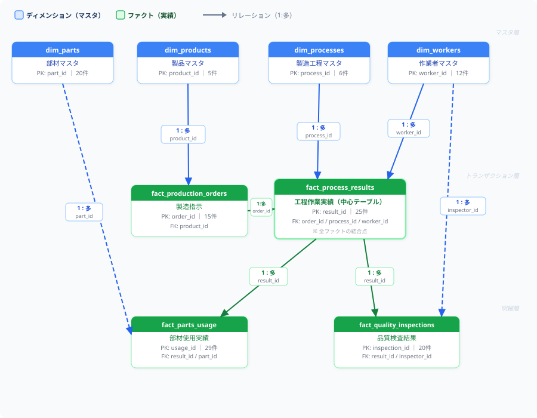

# データ定義書 — Fabric Warehouse & セマンティックモデル

**文書番号**: DD-SPRINT3-001  
**対象**: Microsoft Fabric Warehouse (`manufacturing_warehouse`)  
**セマンティックモデル**: `manufacturing_semantic_model`  
**発行日**: 2026-03-19  
**関連スプリント**: [Sprint 3 README](./README.md)

---

## 目次

1. [データ全体構成](#1-データ全体構成)
2. [テーブル定義](#2-テーブル定義)
   - [dim_products（製品マスタ）](#21-dim_products製品マスタ)
   - [dim_processes（製造工程マスタ）](#22-dim_processes製造工程マスタ)
   - [dim_parts（部材マスタ）](#23-dim_parts部材マスタ)
   - [dim_workers（作業者マスタ）](#24-dim_workers作業者マスタ)
   - [fact_production_orders（製造指示）](#25-fact_production_orders製造指示)
   - [fact_process_results（工程作業実績）](#26-fact_process_results工程作業実績)
   - [fact_parts_usage（部材使用実績）](#27-fact_parts_usage部材使用実績)
   - [fact_quality_inspections（品質検査結果）](#28-fact_quality_inspections品質検査結果)
3. [セマンティックモデル定義](#3-セマンティックモデル定義)
   - [リレーション定義](#31-リレーション定義)
   - [DAX メジャー定義](#32-dax-メジャー定義)
   - [日付テーブル（dim_date）](#33-日付テーブルdim_date)
4. [リレーションで実現できる分析](#4-リレーションで実現できる分析)
5. [実データ概要](#5-実データ概要)

---

## 1. データ全体構成

本 Warehouse は製造工程管理に必要な以下 8 テーブルで構成されます。  
**ディメンションテーブル（マスタ）** 4 本と **ファクトテーブル（実績）** 4 本のスタースキーマ構造です。



---

## 2. テーブル定義

---

### 2.1 dim_products（製品マスタ）

製造対象となる製品の基本情報を管理するマスタテーブルです。  
他のファクトテーブルから参照される製品の「正式名称」「仕様値」の基点となります。

| # | カラム名 | データ型 | NULL | 説明 |
|---|---|---|---|---|
| 1 | `product_id` | VARCHAR(20) | NOT NULL | 製品を一意に識別するID。例: `PROD-001` |
| 2 | `product_name` | VARCHAR(200) | NOT NULL | 製品の正式名称。例: `インバータ制御装置 IVC-3000` |
| 3 | `product_category` | VARCHAR(100) | NOT NULL | 製品カテゴリ区分。`インバータ` / `サーボドライバ` / `PLC` など |
| 4 | `model_number` | VARCHAR(30) | NOT NULL | 型番。例: `IVC-3000`。カタログ・納品書等で使用する識別子 |
| 5 | `voltage_spec_v` | VARCHAR(20) | NULL | 定格電圧仕様（文字列）。例: `200-240`（V）。範囲表記のため文字列型 |
| 6 | `current_spec_a` | DECIMAL(10,2) | NULL | 定格電流仕様（A）。検査基準値の比較対象として使用 |
| 7 | `power_rating_kw` | DECIMAL(10,2) | NULL | 定格出力（kW）。製品の出力クラスを示す |
| 8 | `weight_kg` | DECIMAL(10,2) | NULL | 質量（kg）。梱包・物流管理に使用 |
| 9 | `release_year` | SMALLINT | NULL | 製品発売年。例: `2022` |
| 10 | `status` | VARCHAR(20) | NOT NULL | 製品ステータス。`active`（現行品）/ `discontinued`（廃番）など |
| 11 | `notes` | VARCHAR(1000) | NULL | 備考。製品の特徴・注意事項の自由記述 |

**主キー**: `product_id`  
**登録件数**: 5件（PROD-001〜PROD-005）

**登録製品一覧**:

| product_id | product_name | model_number | 定格電圧 | 定格電流 | 定格出力 |
|---|---|---|---|---|---|
| PROD-001 | インバータ制御装置 IVC-3000 | IVC-3000 | 200-240V | 30A | 7.5kW |
| PROD-002 | サーボモータードライバー SMD-500 | SMD-500 | 200-240V | 10A | 2.0kW |
| PROD-003 | PLCユニット PLC-2000 | PLC-2000 | 24V | 5A | 0.12kW |
| PROD-004 | インバータ制御装置 IVC-5000 | IVC-5000 | 380-440V | 50A | 22kW |
| PROD-005 | サーボモータードライバー SMD-200 | SMD-200 | 100-120V | 5A | 0.5kW |

---

### 2.2 dim_processes（製造工程マスタ）

製造ラインを構成する各工程を順序付きで定義するマスタテーブルです。  
工程は `process_order` の順に実施され、全製品で共通の 6 工程が定義されています。

| # | カラム名 | データ型 | NULL | 説明 |
|---|---|---|---|---|
| 1 | `process_id` | VARCHAR(20) | NOT NULL | 工程を一意に識別するID。例: `PROC-001` |
| 2 | `process_name` | VARCHAR(200) | NOT NULL | 工程の正式名称。例: `基板実装` |
| 3 | `process_order` | SMALLINT | NOT NULL | 工程の実施順序。1が最初、6が最後（梱包） |
| 4 | `department` | VARCHAR(100) | NOT NULL | 担当部署。`製造1課` / `製造2課` / `品質課` / `出荷課` |
| 5 | `standard_time_min` | SMALLINT | NULL | 標準作業時間（分）。実績との乖離を分析するための基準値 |
| 6 | `description` | VARCHAR(1000) | NULL | 工程の作業内容の詳細説明 |
| 7 | `required_skill_level` | VARCHAR(40) | NULL | 必要スキルレベル。`初級` / `中級` / `上級` |
| 8 | `applicable_products` | VARCHAR(400) | NULL | 適用可能な製品IDリスト（セミコロン区切り）。例: `PROD-001;PROD-002` |

**主キー**: `process_id`  
**登録件数**: 6件（PROC-001〜PROC-006）

**工程フロー**:

| process_id | process_name | 順序 | 担当部署 | 標準時間 | 必要スキル |
|---|---|---|---|---|---|
| PROC-001 | 基板実装 | 1 | 製造1課 | 45分 | 中級 |
| PROC-002 | 筐体組立 | 2 | 製造1課 | 30分 | 初級 |
| PROC-003 | 配線作業 | 3 | 製造2課 | 40分 | 中級 |
| PROC-004 | 機能検査 | 4 | 品質課 | 25分 | 上級 |
| PROC-005 | 最終検査 | 5 | 品質課 | 20分 | 中級 |
| PROC-006 | 梱包 | 6 | 出荷課 | 15分 | 初級 |

> **注意**: PROC-003（配線作業）は PROD-003（PLCユニット）には適用なし（内部配線不要のため）

---

### 2.3 dim_parts（部材マスタ）

製造工程で使用する部材・部品の情報を管理するマスタテーブルです。  
代替部材情報（`alternative_part_id`）により、代替調達先の追跡が可能です。

| # | カラム名 | データ型 | NULL | 説明 |
|---|---|---|---|---|
| 1 | `part_id` | VARCHAR(20) | NOT NULL | 部材を一意に識別するID。例: `PART-001` |
| 2 | `part_name` | VARCHAR(200) | NOT NULL | 部材の正式名称。例: `IGBTモジュール 200A` |
| 3 | `part_category` | VARCHAR(100) | NOT NULL | 部材カテゴリ。`半導体` / `コンデンサ` / `基板` / `筐体` / `放熱部品` / `コネクタ` / `電源ユニット` / `冷却部品` / `配線部品` など |
| 4 | `part_number` | VARCHAR(50) | NULL | メーカー型番。例: `IM-200A-001`。発注・検収で使用 |
| 5 | `supplier_name` | VARCHAR(200) | NULL | 仕入先企業名。例: `富士電機` / `村田製作所` / `自社製造` |
| 6 | `unit_price_jpy` | DECIMAL(12,0) | NULL | 単価（円）。部材コスト計算のインプット値 |
| 7 | `lead_time_days` | SMALLINT | NULL | 調達リードタイム（日）。発注から納品までの標準日数 |
| 8 | `stock_unit` | VARCHAR(10) | NULL | 在庫管理単位。`個` / `枚` / `セット` など |
| 9 | `description` | VARCHAR(1000) | NULL | 部材の仕様・用途の詳細説明 |
| 10 | `alternative_part_id` | VARCHAR(20) | NULL | 代替部材の `part_id`。供給停止時の代替品を示す（自己参照） |

**主キー**: `part_id`  
**登録件数**: 20件（PART-001〜PART-020）

**部材カテゴリ別内訳**:

| カテゴリ | 件数 | 主な部材例 |
|---|---|---|
| 半導体 | 3件 | PART-001 IGBTモジュール 200A（富士電機/45,000円）、PART-011 代替品（三菱電機/47,000円）、PART-019 IGBTモジュール 50A（富士電機/18,000円）|
| コンデンサ | 4件 | PART-002 電解コンデンサ 2200μF（日本ケミコン/3,200円）、PART-003 フィルムコンデンサ 0.1μF（村田製作所/80円）他 |
| 基板 | 4件 | PART-004 制御基板 IVC-3000用（自社製造/12,000円）、PART-018 制御基板 SMD-500用（自社製造/15,000円）他 |
| 筐体 | 1件 | PART-005 アルミ筐体 L型（アルミ製品工業/8,500円） |
| 放熱部品 | 2件 | PART-006 放熱フィン 大（熱対策技研/2,200円）、PART-014 代替品 |
| コネクタ | 2件 | PART-007 電源コネクタ 3P（日本航空電子/650円）、PART-015 代替品 |
| 電源ユニット | 2件 | PART-008 スイッチング電源 24V/5A（オムロン/4,800円）、PART-016 代替品 |
| 冷却部品 | 2件 | PART-009 冷却ファン 92mm（山洋電気/1,800円）、PART-017 代替品 |
| 配線部品 | 1件 | PART-010 ケーブルハーネス IVC-3000（自社製造/3,500円） |

> **代替品の関係**: PART-001 ↔ PART-011、PART-002 ↔ PART-012、PART-003 ↔ PART-013、PART-006 ↔ PART-014、PART-007 ↔ PART-015、PART-008 ↔ PART-016、PART-009 ↔ PART-017

---

### 2.4 dim_workers（作業者マスタ）

製造・品質・出荷部門に所属する作業者の情報を管理するマスタテーブルです。  
工程実績（担当者）と品質検査（検査者）の両方から参照されます。

| # | カラム名 | データ型 | NULL | 説明 |
|---|---|---|---|---|
| 1 | `worker_id` | VARCHAR(20) | NOT NULL | 作業者を一意に識別するID。例: `WRK-001` |
| 2 | `last_name` | VARCHAR(40) | NOT NULL | 姓。例: `田中` |
| 3 | `first_name` | VARCHAR(40) | NOT NULL | 名。例: `一郎` |
| 4 | `department` | VARCHAR(100) | NOT NULL | 所属部署。`製造1課` / `製造2課` / `品質課` / `出荷課` |
| 5 | `skill_level` | VARCHAR(40) | NULL | スキルレベル。`初級` / `中級` / `上級` の 3 段階 |
| 6 | `hire_year` | SMALLINT | NULL | 入社年。例: `2010`。勤続年数の計算に使用 |
| 7 | `certifications` | VARCHAR(400) | NULL | 保有資格リスト（セミコロン区切り）。例: `電気工事士2種;はんだ付け技能士2級` |
| 8 | `notes` | VARCHAR(400) | NULL | 備考。役職・OJT状況など |

**主キー**: `worker_id`  
**登録件数**: 12件（WRK-001〜WRK-012）

**部署別・スキル別内訳**:

| 部署 | 上級 | 中級 | 初級 | 主な作業者 |
|---|---|---|---|---|
| 製造1課 | WRK-001（田中、班長）、WRK-012（山田、サブリーダー） | WRK-002（鈴木）、WRK-010（加藤） | WRK-003（佐藤、研修中） | はんだ付け・基板実装・筐体組立担当 |
| 製造2課 | WRK-004（高橋、配線リーダー） | WRK-005（渡辺） | WRK-011（吉田） | 配線作業担当（電気工事士資格保持） |
| 品質課 | WRK-006（伊藤、検査リーダー） | WRK-007（山本） | WRK-008（中村、OJT中） | 機能検査・最終検査・検査証発行担当 |
| 出荷課 | — | WRK-009（小林） | — | 梱包・出荷担当 |

---

### 2.5 fact_production_orders（製造指示）

製品の製造指示（製造オーダー）の計画値と実績値を 1 オーダー 1 レコードで管理するファクトテーブルです。  
スタースキーマの中心となるテーブルで、`fact_process_results` の親レコードです。

| # | カラム名 | データ型 | NULL | 説明 |
|---|---|---|---|---|
| 1 | `order_id` | VARCHAR(30) | NOT NULL | 製造指示を一意に識別するID。例: `PO-2026-001` |
| 2 | `product_id` | VARCHAR(20) | NOT NULL | 製造する製品ID（`dim_products.product_id` への外部キー） |
| 3 | `planned_qty` | SMALLINT | NOT NULL | 計画製造数量（台）。受注・生産計画から設定 |
| 4 | `actual_qty` | SMALLINT | NULL | 実績製造数量（台）。完了した良品台数。進行中は `0` または NULL |
| 5 | `planned_start_date` | DATE | NULL | 計画開始日。生産スケジュールの基準日 |
| 6 | `actual_start_date` | DATE | NULL | 実際の製造開始日 |
| 7 | `planned_end_date` | DATE | NULL | 計画完了（出荷予定）日 |
| 8 | `actual_end_date` | DATE | NULL | 実際の製造完了日。進行中は NULL |
| 9 | `order_status` | VARCHAR(40) | NOT NULL | オーダーステータス。`完了` / `進行中` / `未着手` |
| 10 | `priority` | VARCHAR(20) | NULL | 優先度。`高` / `通常` |
| 11 | `customer_code` | VARCHAR(20) | NULL | 受注先顧客コード。例: `CUST-001`（顧客マスタとは別管理） |
| 12 | `notes` | VARCHAR(1000) | NULL | 備考。遅延理由・特記事項など |

**主キー**: `order_id`  
**外部キー**: `product_id` → `dim_products.product_id`  
**登録件数**: 15件（PO-2026-001〜PO-2026-015）

**ステータス内訳（2026年3月19日時点）**:

| ステータス | 件数 | 期間 |
|---|---|---|
| 完了 | 12件 | 2026年1月〜3月1日 |
| 進行中 | 3件 | 2026年3月3日〜（PO-2026-013/014/015） |

---

### 2.6 fact_process_results（工程作業実績）

各製造指示の各工程の作業実績を 1 工程 × 1 台 = 1 レコードで管理するファクトテーブルです。  
`unit_seq` により同一オーダー内の何台目かを識別します。  
不良が発生した場合は `defect_flag = true` となり、`defect_description` に詳細が記録されます。

| # | カラム名 | データ型 | NULL | 説明 |
|---|---|---|---|---|
| 1 | `result_id` | VARCHAR(30) | NOT NULL | 工程実績を一意に識別するID。例: `PR-001` |
| 2 | `order_id` | VARCHAR(30) | NOT NULL | 製造指示ID（`fact_production_orders.order_id` への外部キー） |
| 3 | `process_id` | VARCHAR(20) | NOT NULL | 工程ID（`dim_processes.process_id` への外部キー） |
| 4 | `unit_seq` | SMALLINT | NOT NULL | 同一オーダー内の製造台数連番。1台目=1、2台目=2... |
| 5 | `start_datetime` | DATETIME2(6) | NULL | 作業開始日時。例: `2026-01-06 08:00` |
| 6 | `end_datetime` | DATETIME2(6) | NULL | 作業終了日時 |
| 7 | `worker_id` | VARCHAR(20) | NULL | 担当作業者ID（`dim_workers.worker_id` への外部キー） |
| 8 | `actual_time_min` | SMALLINT | NULL | 実際の作業時間（分）。標準時間との比較に使用 |
| 9 | `status` | VARCHAR(40) | NOT NULL | 工程ステータス。`完了` / `進行中` / `未着手` |
| 10 | `defect_flag` | BIT | NOT NULL | 不良発生フラグ。`1`（true）= 不良あり、`0`（false）= 正常 |
| 11 | `defect_description` | VARCHAR(1000) | NULL | 不良内容の詳細説明。`defect_flag = true` の場合に記録 |
| 12 | `notes` | VARCHAR(1000) | NULL | 備考。作業上の特記事項 |

**主キー**: `result_id`  
**外部キー**:  
- `order_id` → `fact_production_orders.order_id`  
- `process_id` → `dim_processes.process_id`  
- `worker_id` → `dim_workers.worker_id`  

**登録件数**: 25件（PR-001〜PR-025）

**不良発生レコード**:

| result_id | order_id | process | 不良内容 | 処置 |
|---|---|---|---|---|
| PR-018 | PO-2026-006 | 機能検査（PROC-004） | 出力電流値が上限を超過（32.8A > 31.5A） | 再測定後合格 |
| PR-019 | PO-2026-006 | 最終検査（PROC-005） | 絶縁耐圧試験不合格・基板焦げ跡確認 | 廃棄処分 |

---

### 2.7 fact_parts_usage（部材使用実績）

各工程実績で消費した部材の実績数量とロット番号を記録するファクトテーブルです。  
1 レコード = 「1 工程実績 × 1 部材種別」の使用量となります。  
`lot_number` によるロットトレーサビリティが実現できます。

| # | カラム名 | データ型 | NULL | 説明 |
|---|---|---|---|---|
| 1 | `usage_id` | VARCHAR(30) | NOT NULL | 部材使用実績を一意に識別するID。例: `PU-001` |
| 2 | `result_id` | VARCHAR(30) | NOT NULL | 工程実績ID（`fact_process_results.result_id` への外部キー） |
| 3 | `part_id` | VARCHAR(20) | NOT NULL | 使用した部材ID（`dim_parts.part_id` への外部キー） |
| 4 | `planned_qty` | DECIMAL(10,2) | NULL | 計画使用数量。BOM（部品表）上の使用予定数 |
| 5 | `actual_qty` | DECIMAL(10,2) | NOT NULL | 実際の使用数量。計画との差異が生じた場合は要因調査対象 |
| 6 | `lot_number` | VARCHAR(50) | NULL | 使用部材のロット番号。例: `LOT-2026-001`。品質問題発生時のロット追跡に使用 |
| 7 | `notes` | VARCHAR(400) | NULL | 備考。代替品使用・不合格ロット調査対象などの特記事項 |

**主キー**: `usage_id`  
**外部キー**:  
- `result_id` → `fact_process_results.result_id`  
- `part_id` → `dim_parts.part_id`  

**登録件数**: 29件（PU-001〜PU-029）

**ロット管理の例**:
- `LOT-2026-001`: PART-001（IGBTモジュール 200A）の標準ロット → PR-001、PR-007 で使用  
- `LOT-2026-002`: PART-001 の別ロット → PR-015（PO-2026-006 の 14 台目、代替品ロット）、PR-018（不合格工程）で使用。`notes` に「不合格ロット調査対象」と記録  
- `LOT-2026-003`: PART-001 の最新ロット → PR-020（進行中 PO-2026-013）で使用

---

### 2.8 fact_quality_inspections（品質検査結果）

機能検査（PROC-004）と最終検査（PROC-005）における検査項目ごとの測定値・合否判定を記録するファクトテーブルです。  
1 レコード = 「1 工程実績 × 1 検査項目」となります。

| # | カラム名 | データ型 | NULL | 説明 |
|---|---|---|---|---|
| 1 | `inspection_id` | VARCHAR(30) | NOT NULL | 検査結果を一意に識別するID。例: `QI-001` |
| 2 | `result_id` | VARCHAR(30) | NOT NULL | 検査対象の工程実績ID（`fact_process_results.result_id` への外部キー） |
| 3 | `inspection_item` | VARCHAR(200) | NOT NULL | 検査項目名。例: `出力電流精度` / `絶縁耐圧` / `外観検査` |
| 4 | `inspection_type` | VARCHAR(100) | NULL | 検査種別。`機能検査` / `最終検査` |
| 5 | `measured_value` | DECIMAL(18,4) | NULL | 測定値。外観検査など数値測定が不可能な項目は NULL |
| 6 | `lower_limit` | DECIMAL(18,4) | NULL | 判定下限値。例: インバータ出力電流の下限 `28.5`（A） |
| 7 | `upper_limit` | DECIMAL(18,4) | NULL | 判定上限値。例: インバータ出力電流の上限 `31.5`（A） |
| 8 | `unit` | VARCHAR(20) | NULL | 測定値の単位。`A` / `V` / `mm` / `℃` / `V`（耐圧）など |
| 9 | `pass_fail` | VARCHAR(20) | NOT NULL | 合否判定。`合格` / `不合格` |
| 10 | `inspector_id` | VARCHAR(20) | NULL | 検査実施者の作業者ID（`dim_workers.worker_id` への外部キー） |
| 11 | `inspection_datetime` | DATETIME2(6) | NULL | 検査実施日時 |
| 12 | `notes` | VARCHAR(1000) | NULL | 備考。判定根拠・調整内容など |

**主キー**: `inspection_id`  
**外部キー**:  
- `result_id` → `fact_process_results.result_id`  
- `inspector_id` → `dim_workers.worker_id`  

**登録件数**: 20件（QI-001〜QI-020）

**不合格検査レコード**:

| inspection_id | result_id | 検査項目 | 測定値 | 上下限 | 処置 |
|---|---|---|---|---|---|
| QI-013 | PR-018 | 出力電流精度 | 32.8A | 28.5〜31.5A | 調整後 QI-014 で合格（30.9A） |
| QI-016 | PR-019 | 絶縁耐圧 | 1200V | 下限1500V | 廃棄処分 |
| QI-017 | PR-019 | 外観検査 | — | — | 基板焦げ跡確認・廃棄確定 |

**検査項目一覧（実績データより）**:

| 検査項目 | 種別 | 単位 | 対象製品 |
|---|---|---|---|
| 出力電流精度 | 機能検査 | A | IVC-3000（28.5〜31.5A）、SMD-500（1.90〜2.10A） |
| 出力電圧精度 | 機能検査 | V | IVC-3000（196.0〜204.0V） |
| 保護回路動作(過電流) | 機能検査 | A | IVC-3000（34.0〜36.0A） |
| 動作温度範囲確認 | 機能検査 | ℃ | IVC-3000（55℃以下確認） |
| 位置決め精度 | 機能検査 | mm | SMD-500（±0.01mm以内） |
| EtherCAT通信確認 | 機能検査 | — | SMD-500 |
| 絶縁耐圧 | 最終検査 | V | 全製品（1500V印加） |
| 外観検査 | 最終検査 | — | 全製品 |
| 銘板・ラベル確認 | 最終検査 | — | 全製品 |

---

## 3. セマンティックモデル定義

**モデル名**: `manufacturing_semantic_model`  
Power BI および Fabric Data Agent から利用するための意味的定義レイヤーです。

---

### 3.1 リレーション定義

以下のリレーションがセマンティックモデルに設定されています。

```
dim_products ──(1)────────(多)── fact_production_orders
dim_processes ──(1)───────(多)── fact_process_results
dim_workers ──(1)─────────(多)── fact_process_results  （担当作業者）
dim_workers ──(1)─────────(多)── fact_quality_inspections  （検査者）
fact_production_orders ──(1)──(多)── fact_process_results
fact_process_results ──(1)────(多)── fact_parts_usage
fact_process_results ──(1)────(多)── fact_quality_inspections
dim_parts ──(1)───────────(多)── fact_parts_usage
```

**リレーション一覧**:

| No | 起点テーブル | 起点カラム | 終点テーブル | 終点カラム | 方向 | 意味 |
|---|---|---|---|---|---|---|
| R-01 | `fact_production_orders` | `product_id` | `dim_products` | `product_id` | 多:1 | 製造指示が「どの製品を」製造するかを示す |
| R-02 | `fact_process_results` | `order_id` | `fact_production_orders` | `order_id` | 多:1 | 工程実績が「どの製造指示の」作業かを示す |
| R-03 | `fact_process_results` | `process_id` | `dim_processes` | `process_id` | 多:1 | 工程実績が「どの工程の」作業かを示す |
| R-04 | `fact_process_results` | `worker_id` | `dim_workers` | `worker_id` | 多:1 | 工程実績の「担当作業者」を示す |
| R-05 | `fact_parts_usage` | `result_id` | `fact_process_results` | `result_id` | 多:1 | 部材使用が「どの工程実績で」消費されたかを示す |
| R-06 | `fact_parts_usage` | `part_id` | `dim_parts` | `part_id` | 多:1 | 使用された「部材の詳細情報」を示す |
| R-07 | `fact_quality_inspections` | `result_id` | `fact_process_results` | `result_id` | 多:1 | 検査結果が「どの工程実績の」検査かを示す |
| R-08 | `fact_quality_inspections` | `inspector_id` | `dim_workers` | `worker_id` | 多:1 | 検査結果の「検査実施者」を示す |

> **dim_workers の二重参照について**  
> `dim_workers` は工程実績（担当作業者: R-04）と品質検査（検査者: R-08）の両方から参照されます。  
> Power BI では `fact_quality_inspections[inspector_id]` への接続はロールプレイングディメンション（非アクティブリレーション）として扱い、`USERELATIONSHIP` 関数で切り替えます。

---

### 3.2 DAX メジャー定義

セマンティックモデルに登録されている計算メジャーの一覧と説明です。

| メジャー名 | 計算式の概要 | 説明 | 活用シーン |
|---|---|---|---|
| `完了台数` | `CALCULATE(SUM(actual_qty), order_status = "完了")` | ステータスが「完了」の製造指示の実績台数合計 | 月別・製品別の生産実績集計 |
| `計画台数` | `SUM(planned_qty)` | 全製造指示の計画台数合計 | 生産計画の把握 |
| `達成率_pct` | `完了台数 / 計画台数 × 100` | 計画に対する完了率（%） | 生産進捗の KPI モニタリング |
| `平均作業時間_分` | `AVERAGE(actual_time_min)` | 工程実績の平均作業時間（分） | 工程別の作業効率分析 |
| `標準時間比率_pct` | `AVERAGEX(実作業時間) / AVERAGEX(標準時間) × 100` | 実作業時間の標準時間に対する比率 | 工程ごとの効率・難易度評価 |
| `検査合格数` | `CALCULATE(COUNTROWS(fact_quality_inspections), pass_fail = "合格")` | 合否判定が「合格」の検査レコード数 | 品質状況の集計 |
| `検査不合格数` | `CALCULATE(COUNTROWS(fact_quality_inspections), pass_fail = "不合格")` | 合否判定が「不合格」の検査レコード数 | 品質問題の件数把握 |
| `工程不良率_pct` | `不良フラグが true の実績数 / 全実績数 × 100` | 工程実績のうち不良が発生した割合（%） | 工程・製品別の品質評価 |
| `平均遅延日数` | `AVERAGEX(完了オーダー, actual_end_date − planned_end_date)` | 計画完了日に対する実績完了日の平均遅延日数 | 納期遵守状況の分析 |
| `部材使用コスト_円` | `SUMX(fact_parts_usage, actual_qty × unit_price_jpy)` | 部材の実使用量と単価から算出した推計コスト | 製品・工程別の材料費試算 |

---

### 3.3 日付テーブル（dim_date）

時系列分析のため DAX で生成される計算テーブルです。  
**カバー期間**: 2025年1月1日〜2027年12月31日

| カラム名 | 意味 |
|---|---|
| `Date` | 日付（基準キー）。`fact_production_orders` の日付カラムとリレーションを設定 |
| `Year` | 年（例: `2026`） |
| `Month` | 月（1〜12） |
| `MonthName` | 月名（日本語）。例: `1月` |
| `Quarter` | 四半期。例: `Q1` |
| `WeekNumber` | 暦週番号（ISO週） |
| `DayOfWeek` | 曜日番号（月=1、日=7） |
| `DayName` | 曜日名（日本語）。例: `月曜日` |
| `YearMonth` | 年月文字列。例: `2026-02`。時系列グラフの軸として使用 |
| `IsWeekend` | 土日フラグ。`TRUE` / `FALSE` |

---

## 4. リレーションで実現できる分析

リレーションが接続されることで、複数テーブルをまたいだ以下の分析が自然言語クエリや DAX で可能になります。

---

### 4.1 製品別の製造実績分析

**接続するリレーション**: R-01（fact_production_orders → dim_products）

| 分析内容 | 取得できる情報 |
|---|---|
| 製品別の製造完了台数（月別） | どの製品が何台完了したか。例: 2026年2月にインバータ IVC-3000 が 12 台完了 |
| 製品別の計画台数と達成率 | planned_qty / actual_qty の比較で生産計画の達成度を製品ごとに把握 |
| 製品カテゴリ別の生産量トレンド | インバータ系 vs サーボドライバ系の比較 |
| 顧客別・製品別の出荷実績 | customer_code × product_name でどの顧客に何を何台出荷したか |

---

### 4.2 工程別の作業効率分析

**接続するリレーション**: R-02（fact_process_results → fact_production_orders）、R-03（fact_process_results → dim_processes）

| 分析内容 | 取得できる情報 |
|---|---|
| 工程別の平均作業時間 vs 標準時間 | どの工程が標準時間を超過しているか（PROC-003 配線作業は超過傾向） |
| 製品別の工程ごと作業時間 | 製品 IVC-3000 の基板実装は平均何分か |
| 工程別の不良発生率 | どの工程でどの程度の不良が発生しているか（最終検査での不合格率） |
| 製造指示ごとの全工程進捗 | PO-2026-013 は PROC-003 まで完了、次は PROC-004 へ |

---

### 4.3 作業者別のパフォーマンス分析

**接続するリレーション**: R-04（fact_process_results → dim_workers）

| 分析内容 | 取得できる情報 |
|---|---|
| 作業者別の担当工程数・製造台数 | WRK-001（田中）は基板実装を何台担当したか |
| 作業者別の平均作業時間と標準時間比 | スキルレベルと実作業時間の相関分析 |
| 不良発生作業者の特定 | defect_flag = true の工程を担当した作業者の傾向分析 |
| 部署別の稼働量 | 製造1課 vs 製造2課 の工数比較 |

---

### 4.4 品質トレース・不良原因分析

**接続するリレーション**: R-07（fact_quality_inspections → fact_process_results）、R-02、R-01、R-04

| 分析内容 | 取得できる情報 |
|---|---|
| 不合格品の製品・工程・作業者の特定 | 検査 QI-016 が不合格である工程実績 PR-019 → 製造指示 PO-2026-006（PROD-001）→ 担当作業者は WRK-006（伊藤） |
| 検査項目別の合否集計 | 絶縁耐圧試験の不合格件数・不合格率 |
| 不合格製品の測定値分布 | 出力電流の測定値が上下限に対してどの範囲に集中しているか |
| 検査員別の不合格検出率 | どの検査員が何件の不合格を検出しているか（品質管理の偏り確認） |

---

### 4.5 部材トレーサビリティ分析

**接続するリレーション**: R-05（fact_parts_usage → fact_process_results）、R-06（fact_parts_usage → dim_parts）、R-02、R-07

| 分析内容 | 取得できる情報 |
|---|---|
| 不合格品に使用された部材のロット特定 | QI-016（不合格）→ PR-019 → PU-028 → PART-001、ロット `LOT-2026-002` を特定 → 同ロットを使用した他の製品を洗い出し |
| 部材別の使用実績集計 | IGBT モジュールが今月何個消費されたか |
| 部材コスト vs 製品別の材料費 | PROD-001 1台あたりの部材コスト試算 |
| 調達リードタイムが長い部材の使用量予測 | リードタイム 21 日の部材（基板類）の在庫計画 |
| 代替品の使用実績 | PART-011（IGBTモジュール代替品）が実際に使用されたか |

---

### 4.6 製造ライン全体サマリー分析

全リレーション（R-01〜R-08）を組み合わせることで、以下のような経営・管理用サマリーが得られます。

| サマリー内容 | 使用テーブル | 取得できる情報例 |
|---|---|---|
| 月次生産サマリー | fact_production_orders + dim_products | 2月完了: IVC-3000 計22台、SMD-500 計14台、PLC-2000 計45台、IVC-5000 計5台 |
| 工程別品質サマリー | fact_process_results + fact_quality_inspections | 工程不良率: 最終検査で1/15件（6.7%）不合格 |
| 納期遵守状況 | fact_production_orders | 完了12件中、遅延3件（PO-2026-002, PO-2026-004, PO-2026-005） |
| 部材コスト集計 | fact_parts_usage + dim_parts | IGBT モジュールの今月消費コスト（実績台数 × 単価で試算） |
| 作業者別稼働サマリー | fact_process_results + dim_workers | 田中（WRK-001）: 基板実装を5回担当、不良発生なし |

---

## 5. 実データ概要

Warehouse にロードされているデータの規模と期間をまとめます。

| テーブル | レコード数 | データ期間 | 備考 |
|---|---|---|---|
| `dim_products` | 5件 | — | PROD-001〜005（全件 active） |
| `dim_processes` | 6件 | — | PROC-001〜006（全工程） |
| `dim_parts` | 20件 | — | PART-001〜020（代替品 7 ペア含む） |
| `dim_workers` | 12件 | — | WRK-001〜012（4部署） |
| `fact_production_orders` | 15件 | 2026-01-06〜進行中 | 完了12件・進行中3件 |
| `fact_process_results` | 25件 | 2026-01-06〜2026-03-06 | 不良あり2件（PR-018, PR-019） |
| `fact_parts_usage` | 29件 | 2026-01-06〜2026-03-03 | ロット番号: LOT-2026-001〜LOT-2026-120 |
| `fact_quality_inspections` | 20件 | 2026-01-06〜2026-03-03 | 不合格3件（QI-013, QI-016, QI-017） |

**非構造化データ（OneLake / Files/）**:

| フォルダ | ファイル数 | 内容 |
|---|---|---|
| `Files/product_specs/` | 2ファイル | PROD-001 インバータ仕様書、PROD-002 サーボドライバ仕様書 |
| `Files/work_manuals/` | 4ファイル | PROC-001〜004 の作業手順書（基板実装・筐体組立・配線・機能検査） |
| `Files/parts_catalog/` | 2ファイル | PART-001 IGBTモジュール、PART-004 制御基板のカタログ |
| `Files/quality_standards/` | 2ファイル | PROD-001 インバータ・PROD-002 サーボドライバの品質基準書 |

> **注意**: 非構造化データの RAG インデックス作成は、Sprint 3 時点で `unstructured_data_rag` パッケージ非公開のため未完了。Microsoft が同パッケージを公開後に再インデックスを実施する。

---

*本定義書は Sprint 3 完了時点の実装内容に基づいています。データ追加・スキーマ変更時は本文書も更新してください。*
